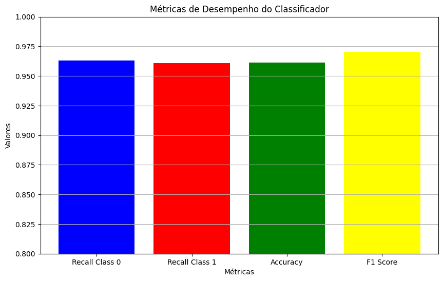
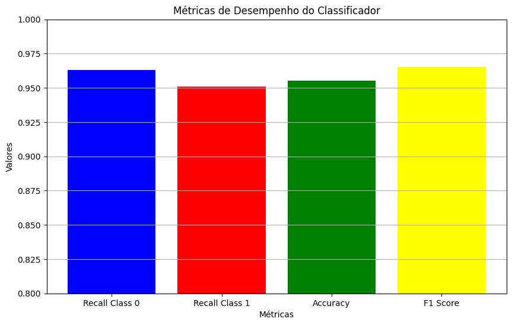

# Preparação dos dados

<!-- Guia do Doc -->
<!--
Nesta etapa, deverão ser descritas todas as técnicas utilizadas para pré-processamento/tratamento dos dados.

Algumas das etapas podem estar relacionadas à:

* Limpeza de Dados: trate valores ausentes: decida como lidar com dados faltantes, seja removendo linhas, preenchendo com médias, medianas ou usando métodos mais avançados; remova _outliers_: identifique e trate valores que se desviam significativamente da maioria dos dados.

* Transformação de Dados: normalize/padronize: torne os dados comparáveis, normalizando ou padronizando os valores para uma escala específica; codifique variáveis categóricas: converta variáveis categóricas em uma forma numérica, usando técnicas como _one-hot encoding_.

* _Feature Engineering_: crie novos atributos que possam ser mais informativos para o modelo; selecione características relevantes e descarte as menos importantes.

* Tratamento de dados desbalanceados: se as classes de interesse forem desbalanceadas, considere técnicas como _oversampling_, _undersampling_ ou o uso de algoritmos que lidam naturalmente com desbalanceamento.

* Separação de dados: divida os dados em conjuntos de treinamento, validação e teste para avaliar o desempenho do modelo de maneira adequada.
  
* Manuseio de Dados Temporais: se lidar com dados temporais, considere a ordenação adequada e técnicas específicas para esse tipo de dado.
  
* Redução de Dimensionalidade: aplique técnicas como PCA (Análise de Componentes Principais) se a dimensionalidade dos dados for muito alta.

* Validação Cruzada: utilize validação cruzada para avaliar o desempenho do modelo de forma mais robusta.

* Monitoramento Contínuo: atualize e adapte o pré-processamento conforme necessário ao longo do tempo, especialmente se os dados ou as condições do problema mudarem.

* Entre outras....

Avalie quais etapas são importantes para o contexto dos dados que você está trabalhando, pois a qualidade dos dados e a eficácia do pré-processamento desempenham um papel fundamental no sucesso de modelo(s) de aprendizado de máquina. É importante entender o contexto do problema e ajustar as etapas de preparação de dados de acordo com as necessidades específicas de cada projeto. -->

Para a preparação dos dados no treinamento de modelos de machine learning, foram seguidos dois passos principais:

### Codificação de categorias
Para codificar as categorias binárias foi usado a estratégia de _label encoding_, onde colunas categóricas serão convertidas para atributos numéricos
```python3
# Aqui as colunas são normalizadas para o processamento seguinte
data = pd.read_csv('../dataset-full.csv')
data.columns = data.columns.str.strip().str.lower().str.replace(' ', '_').str.replace('(', '').str.replace(')', '')
........
# Aqui um objeto da classe LabelEncoder é criado, ele é o responsável por converter os atributos Yes e No para 0 e 1 respectivamente
label_encoder = LabelEncoder()

# O gênero é convertido manualmente pois o a classe de processamento LabelEncoder não suporta nativamente Male e Female
data['gender'] = data['gender'].map({'Male': 1, 'Female': 2})

# Finalmente ao realizar um loop na lista de atributos do dataset todos são categorizados
for column in sorted_headers_relevance + ['class']:
    data[column] = label_encoder.fit_transform(data[column])
```

As características categóricas foram transformadas em valores numéricos para facilitar o cálculo de probabilidades pelos algoritmos. Campos como "Sim" e "Não" foram codificados como 1 e 0, respectivamente, e a mesma lógica foi aplicada às variáveis "classe" (positivo e negativo para risco de diabetes) e "gênero" (masculino e feminino).

Sobre o gênero é importante notar que foi definido Male = 1 e Female = 2, essa escolha não apresenta efeitos colaterais na análise, desde que os rótulos sejam respeitados durante todo o ciclo de vida do modelo.

A idade foi preservada e não foi convertida para uma categoria.

### Separação dos dados
O conjunto de dados foi dividido em 70% para treinamento e 30% para teste, permitindo que o modelo aprenda com a maior parte dos dados enquanto é testado em dados inéditos.

```python3
 X_train, X_test, y_train, y_test = train_test_split(X, y, train_size=0.7, stratify=y, random_state=42)
```
Utilizando da função `train_test_split` que é capaz de separar a base de dados em uma porção de teste e outra porção para validação. Do parâmetros utilizados os mais importantes são:

- train_size: Descreve o valor da proporção em que o dataset irá ser quebrado, nesse caso o valor 0.7, representa o mesmo que 70%. Logo 70% será separado para treinamento e 30% para validação.
- stratify: Realiza amostragem estratificada pela classificação de diabetes. isso significa que a mesma proporção de diagnósticos positivos e negativos que existe no dataset completo será utilizado na amostra de testes e consequentemente na amostra de validação.
- random_state: É uma semente utilizada para construir números pseudoaleatórios, sendo assim em toda execução os mesmos dados de testes serão extraídos.


</br>
</br>

[Link para Código de preparação Simplificado](/src/dataPreparation.py)

# Descrição dos modelos

<!-- Guid do Doc -->
<!--
Nesta seção, conhecendo os dados e de posse dos dados preparados, é hora de descrever os algoritmos de aprendizado de máquina selecionados para a construção dos modelos propostos. Inclua informações abrangentes sobre cada algoritmo implementado, aborde conceitos fundamentais, princípios de funcionamento, vantagens/limitações e justifique a escolha de cada um dos algoritmos. 

Explore aspectos específicos, como o ajuste dos parâmetros livres de cada algoritmo. Lembre-se de experimentar parâmetros diferentes e principalmente, de justificar as escolhas realizadas.

Como parte da comprovação de construção dos modelos, um vídeo de demonstração com todas as etapas de pré-processamento e de execução dos modelos deverá ser entregue. Este vídeo poderá ser do tipo _screencast_ e é imprescindível a narração contemplando a demonstração de todas as etapas realizadas. -->

## Naive bayes
O algoritmo Naive Bayes, baseado no Teorema de Bayes, foi selecionado por tratar todas as variáveis de entrada como independentes entre si, mesmo que, na prática, essa suposição nem sempre seja válida. Essa simplicidade torna o Naive Bayes um modelo atrativo, rápido e eficiente para tarefas de classificação, especialmente com dados categóricos e binários, como os presentes no dataset analisado.

Foi utilizado o objeto GaussianNB, que assume que os atributos seguem uma distribuição normal para cada classe.
```python3
gnb = GaussianNB()
```
Isso foi escolhido para preservar os detalhes relacionados ao atributo idade, já que ele não é uma categoria e a sua conversão em faixas etárias causaria a perda de detalhes. É importante deixar claro que esse algoritmo somente se mostrou adequado nesse caso pois o atributo "idade" apresenta uma distribuição normal, atributos com uma variação muito grande em sua distribuição não seriam adequados.

A análise do heatmap indicou a necessidade de ordenar as colunas de acordo com o valor de correlação com a classificação de diabetes.
</br> </br> </br> </br>
Seguindo essa lógica, as variáveis foram ordenadas com base no valor de correlação com a classificação de diabetes, priorizando aquelas que apresentaram maior influência na determinação da presença ou ausência da condição. A lista abaixo reflete essa priorização:

1. polyuria
2. polydipsia
3. age
4. gender
5. sudden_weight_loss
6. partial_paresis
7. polyphagia
8. irritability
9. alopecia
10. visual_blurring
11. weakness
12. muscle_stiffness
13. genital_thrush
14. obesity
15. delayed_healing
16. itching

Para construir essa lista foi necessário carregar o dataset em memória utilizando o pandas
```python3
df = pd.read_csv('./dataset-full.csv')
```

Converter as variáveis categóricas como gênero e classificações binárias (Sim/Não) para valores numéricos
```python3
df.replace({'Yes': 1, 'No': 0, 'Positive': 1, 'Negative': 0, 'Male': 1, 'Female': 2}, inplace=True)
```

E finalmente calcular a matriz de correlação entre todas as variáveis

```python3
# Define a função que vai calcular a correlação entre duas variáveis tendo como entrada duas listas com valores medidos
def cramers_v(x, y):
    contingency_table = pd.crosstab(x, y)
    chi2, _, _, _ = chi2_contingency(contingency_table)
    n = contingency_table.sum().sum()
    return (chi2 / (n * (min(contingency_table.shape) - 1))) ** 0.5

# Para cada coluna do dataset aplica a validação com todas as colunas do dataset
# Dessa forma todos os atributos serão testados com todos os atributos
# Essa parte é essencial para construir o heatmap porém é descartável para construir a lista
correlation_matrix = df.apply(lambda x: df.apply(lambda y: cramers_v(x, y)))
```

Então é calculado a correlação para todas as colunas do dataset em relação ao diagnóstico com excessão do proprio diagnóstico
```python3
class_correlations = {col: cramers_v(df[col], df['class']) for col in df.columns if col != 'class'}
```

O resultado é um dicionário relacionando a coluna ao valor de correlação com o diagnóstico, então basta ordenar e exibir os valores
```python3
sorted_relevance = sorted(class_correlations.items(), key=lambda item: item[1], reverse=True)

print("Relevância das variáveis em relação à variável 'class':")
for variable, relevance in sorted_relevance:
    print(f"{variable}: {relevance:.4f}")
```

Associando a ordem com suas respectivas colunas o seguinte ranking é formado:
```python3
sorted_headers_relevance = [
    'polyuria',
    'polydipsia',
    'age',
    'gender',
    'sudden_weight_loss',
    'partial_paresis',
    'polyphagia',
    'irritability',
    'alopecia',
    'visual_blurring',
    'weakness',
    'muscle_stiffness',
    'genital_thrush',
    'obesity',
    'delayed_healing',
    'itching',
]

```

Devido à presença de diversos atributos, para analisar até que ponto o aumento deles influencia a qualidade do modelo, será adotada a seguinte estratégia:
1. Selecionar o 1º atributo
2. Treinar o modelo utilizando apenas esse atributo.
3. Verificar o valor do recall.
4. Retornar à etapa 1, adicionando o próximo atributo na sequência
5. Repetir o fluxo até que todos os atributos sejam utilizados.

### Normalizando colunas do dataset
1. Remover espaços, tabulações e quebras de linhas das colunas
2. Converter todos os caracteres para minúsculos
3. Substituir espaços em branco por underscore
4. Remover caracteres de parênteses
```python3
data.columns = data.columns.str.strip().str.lower().str.replace(' ', '_').str.replace('(', '').str.replace(')', '')
```
No final a saída disso é o nome de todas as colunas no formato [snake_case](https://developer.mozilla.org/en-US/docs/Glossary/Snake_case), isso vai ser essencial ao comparar com o ranking de atributos relacionados com o diagnóstico.


### Iteração consumindo os atributos
Para iterar sobre as colunas disponíveis e apresentar uma análise gráfica, foi utilizada a estrutura `for`, que permite controlar a quantidade de atributos a serem utilizados no modelo. O loop começa com 1 coluna e segue até a 16ª coluna, incrementando a cada iteração. Essa abordagem permite treinar o modelo progressivamente, ajustando o número de atributos e avaliando o impacto nas métricas de desempenho, como o recall. O gráfico gerado ao final mostrará como a inclusão de atributos adicionais influencia a performance do modelo à medida que mais colunas são adicionadas.

```python3
for i in range(1, len(sorted_headers_relevance) + 1):
```

Todas as operações a seguir são feitas dentro do loop.
Para garantir um modelo sempre limpo, para a execução anterior não atrapalhar nas métricas, dentro do loop é criado o objeto que representa o algoritmo de Naive Bayes.
```python3
gnb = GaussianNB()
```

E utilizando a notação de lista do python é possível pegar as primeiras colunas e extrair elas do dataframe
```python3
X = data[sorted_headers_relevance[:i]]
```

Separa as amostras de teste e de validação
```python3
X_train, X_test, y_train, y_test = train_test_split(X, y, train_size=0.7, stratify=y, random_state=42)
```

Utiliza a função fit do algoritmo GaussianNB para transformar os dados, calcular as taxas de erro e ajustar os parâmetros internos. Todos esses passos são abstraídos pela biblioteca.
```python3
gnb.fit(X_train, y_train)
```

E agora com o modelo pronto, deve ser analisado como ele se comporta com novos dados. Então o restante dos dados é utilizado para validação.
```python3
y_pred = gnb.predict(X_test)
```

Com a predição do modelo é possível calcular as métricas de qualidade.
```python3
recall_0 = recall_score(y_test, y_pred, pos_label=0)
recall_1 = recall_score(y_test, y_pred, pos_label=1)
accuracy = accuracy_score(y_test, y_pred)
f1 = f1_score(y_test, y_pred)
```

As métricas são salvas em uma lista no formato (número de atributos, valor da métrica), isso será útil para construir o gráfico de evolução do modelo baseado na quantidade de atributos.
```python3
recall_class_0.append((i, recall_0))
recall_class_1.append((i, recall_1))
model_accuracy.append((i, accuracy))
f1_score_ls.append((i, f1))
```


### Exibição dos gráficos
Contendo várias listas que apresentam o formato (número de atributos, valor da métrica), elas devem ser convertidas para dataframes para permitir melhor integração com a biblioteca de gráficos.
```python3
recall_df_0 = pd.DataFrame(recall_class_0, columns=['Number of Features', 'Recall Class 0'])
recall_df_1 = pd.DataFrame(recall_class_1, columns=['Number of Features', 'Recall Class 1'])
accuracy_df = pd.DataFrame(model_accuracy, columns=['Number of Features', 'Accuracy'])
f1_df = pd.DataFrame(f1_score_ls, columns=['Number of Features', 'F1 Score'])
```


Define um tamanho para a imagem
```python3
plt.figure(figsize=(10, 6))
```

Adiciona as várias linhas no gráfico, diferenciando pela cor
```python3
plt.plot(recall_df_0['Number of Features'], recall_df_0['Recall Class 0'], label='Recall Class 0', marker='o', linestyle='-', color='b')
plt.plot(recall_df_1['Number of Features'], recall_df_1['Recall Class 1'], label='Recall Class 1', marker='o', linestyle='-', color='r')
plt.plot(accuracy_df['Number of Features'], accuracy_df['Accuracy'], label='Accuracy', marker='o', linestyle='-', color='g')
plt.plot(f1_df['Number of Features'], f1_df['F1 Score'], label='F1 Score', marker='o', linestyle='-', color='y')
```


Configura informações de legenda para melhor legibilidade do gráfico
```python3
plt.title('Recall vs Number of Features for Class 0 and Class 1')
plt.xlabel('Number of Features')
plt.ylabel('Metrics')
plt.grid(True)
plt.legend()
```

Exibe o gráfico de resultado
```python3
plt.plot()
```


O código completo pode ser conferido aqui [Link para Código](/src/NaiveBayers.py)

## Random Forest

Floresta Aleatória, ou Florestas de Decisão Aleatórias, é um método de aprendizado de conjunto utilizado para tarefas de classificação, regressão e outras análises preditivas [^1]. Uma hipótese para o uso do Random Forest é que sua capacidade de combinar múltiplas árvores de decisão pode gerar previsões mais estáveis e confiáveis, mesmo em cenários com dados complexos ou ruidosos [^2]. Dessa forma, optei por testar esta abordagem da seguinte forma:

```
%pip install pandas scikit-learn
%pip install graphviz pydotplus
import pandas as pd
from sklearn.model_selection import train_test_split
from sklearn.ensemble import RandomForestClassifier
from sklearn.tree import export_graphviz
from sklearn.metrics import accuracy_score, classification_report
import pydotplus
from IPython.display import Image
import graphviz
```

Iniciei com a instalação das bibliotecas necessárias para manipulação de dados, criação do modelo de aprendizado de máquina Random Forest e visualização das árvores de decisão, utilizando ferramentas como pandas, scikit-learn, graphviz e pydotplus, além de integrar a função Image para exibição das visualizações no ambiente de desenvolvimento.

```
path = '/content/diabetes_risk_prediction_dataset.csv'

dados = pd.read_csv(path)

X = dados.drop('class', axis=1)
y = dados['class']
```
Carreguei o conjunto de dados a partir de um arquivo CSV para trabalhar com as informações sobre o risco de diabetes. Separei as colunas de dados em duas partes: as colunas com as características dos pacientes, como idade, níveis de glicose, pressão arterial, etc., que foram colocadas na variável X; e a coluna 'class', que indica se a pessoa tem ou não diabetes, que foi colocada na variável y. A coluna 'class' foi escolhida para y porque ela contém o que queremos prever: se a pessoa tem diabetes (1) ou não (0). Essa separação é necessária para que o modelo de aprendizado de máquina consiga aprender com as características dos pacientes e fazer previsões sobre o risco de diabetes com base nos dados fornecidos.
```
X_train, X_test, y_train, y_test = train_test_split(X, y, test_size=0.2, random_state=42)
```
Dividi os dados em dois conjuntos: um para treinar o modelo e outro para testar o desempenho do modelo depois de treinado. Usei a função train_test_split para fazer essa divisão, onde 80% dos dados foram destinados ao treinamento do modelo e 20% foram reservados para testar as previsões do modelo, o que é especificado pelo parâmetro test_size=0.2. A divisão foi feita de forma aleatória, mas para garantir que os resultados sejam reproduzíveis, usei o parâmetro random_state=42, que fixa a semente da aleatoriedade. Dessa forma, qualquer pessoa que rodar o código terá a mesma divisão dos dados.

```
modelo = RandomForestClassifier(n_estimators=100, random_state=42)
modelo.fit(X_train, y_train)
```
Neste trecho eu crio o modelo de aprendizado de máquina usando o algoritmo Random Forest. Defini que o modelo deveria ter 100 árvores (n_estimators=100), o que ajuda a melhorar a precisão das previsões. Além disso, fixei a semente da aleatoriedade com random_state=42, garantindo que os resultados possam ser reproduzidos. Em seguida, treinei o modelo utilizando os dados de treinamento (X_train e y_train), ou seja, fiz o modelo aprender a partir das características dos pacientes e seus respectivos diagnósticos de diabetes.

Importante dizer que a função `RandomForestClassifier` oferece outros parâmetros que podem ser ajustados para otimizar o desempenho do modelo. No entanto, neste momento, optei por utilizar os valores padrão para simplificar a configuração inicial e focar na implementação.

```
y_pred = modelo.predict(X_test)

precisao = accuracy_score(y_test, y_pred)
relatorio_classificacao = classification_report(y_test, y_pred)

print(f'A precisão do modelo é: {precisao:.2f}')
print("\nRelatório de Classificação:")
print(relatorio_classificacao)
```
Aqui eu utilizei o modelo treinado para fazer previsões com os dados de teste, armazenando os resultados na variável y_pred. Em seguida, calculei a precisão do modelo utilizando a função accuracy_score, que compara as previsões feitas (y_pred) com os valores reais de teste (y_test). Também gerei um relatório detalhado de classificação com a função classification_report, que fornece métricas como precisão, recall e F1-score para cada classe. Por fim, imprimi a precisão do modelo e o relatório de classificação para avaliar seu desempenho nas previsões do risco de diabetes.

É possível verificar o código completo [neste link](/src/random-forest.ipynb).


## Decision Tree

# Primeiro Teste: SMOTE

Uma árvore de decisão é um modelo de aprendizado de máquina baseado em uma estrutura hierárquica que organiza decisões em etapas sucessivas, de forma semelhante a um fluxograma. É usada para resolver problemas de classificação ou regressão ao dividir os dados em subconjuntos menores com base em regras de decisão derivadas dos valores das variáveis.

Para o primeiro teste utilizando árvore de decisão, foi utilizado o SMOTE para balanceamento dos dados.

Colunas do dataset ordenadas pela relevância em relação à classificação
```python3
sorted_headers_relevance = [
    'polyuria', 'polydipsia', 'age', 'gender', 'sudden_weight_loss',
    'partial_paresis', 'polyphagia', 'irritability', 'alopecia', 'visual_blurring',
    'weakness', 'muscle_stiffness', 'genital_thrush', 'obesity', 'delayed_healing', 'itching'
]
```

 O dataset foi carregado a partir de um arquivo CSV, contendo informações detalhadas sobre pacientes, sintomas e diagnósticos.
```python3
data = pd.read_csv('../dataset-full.csv')
```

 Os cabeçalhos das colunas foram renomeados para o formato snake_case, o que envolveu a remoção de espaços e caracteres especiais para garantir a consistência e facilitar o acesso aos dados programaticamente.
```python3
data.columns = data.columns.str.strip().str.lower().str.replace(' ', '_').str.replace('(', '').str.replace(')', '')
```

A coluna 'gender', que continha valores categóricos ('Male' e 'Female'), foi tratada manualmente, mapeando 'Male' para 1 e 'Female' para 2, transformando os dados em formato numérico compatível com o modelo.
```python3
data['gender'] = data['gender'].map({'Male': 1, 'Female': 2})
```

As demais colunas com valores descritivos foram convertidas para dados numéricos utilizando o LabelEncoder, o que permitiu representar categorias como números inteiros.
```python3
label_encoder = LabelEncoder()
```

As variáveis independentes (features) foram separadas das variáveis dependentes (target), sendo que o alvo escolhido foi a coluna que representa a classificação de diabetes.
```python3
for column in sorted_headers_relevance + ['class']:
    data[column] = label_encoder.fit_transform(data[column])
```

 Os dados foram divididos em conjuntos de treino (70%) e teste (30%), utilizando estratificação com base na variável alvo, para garantir que a proporção das classes fosse mantida em ambos os conjuntos.
```python3
y = data['class']
X = data[sorted_headers_relevance]
X_train, X_test, y_train, y_test = train_test_split(X, y, train_size=0.7,random_state=42)
```

### 2. Balanceamento das Classes (SMOTE) ###
O método SMOTE foi aplicado ao conjunto de treino para gerar exemplos sintéticos da classe minoritária, garantindo um balanceamento adequado entre as classes e prevenindo o viés do modelo em relação à classe majoritária.
```python3
smote = SMOTE(random_state=42)
X_train_bal, y_train_bal = smote.fit_resample(X_train, y_train)
```

Foi inicializado um modelo de árvore de decisão com um random_state fixo, assegurando que os resultados fossem replicáveis em futuras execuções.
```python3
gnb = DecisionTreeClassifier(random_state=42)
```

O modelo foi treinado utilizando o conjunto de treino balanceado, permitindo que ele aprendesse os padrões e critérios de decisão necessários para realizar a classificação.
```python3
gnb.fit(X_train_bal, y_train_bal)
```

Após o treinamento, o modelo foi utilizado para realizar previsões no conjunto de teste, produzindo resultados que puderam ser comparados aos valores reais da variável alvo.
```python3
y_pred = gnb.predict(X_test)
```

### 5. Cross-validation (Validação Cruzada) ###
Uma validação cruzada foi realizada, dividindo os dados em cinco subconjuntos para calcular as métricas recall e acurácia em diferentes partições, avaliando a robustez e generalização do modelo.
```python3
cross_val_recall = cross_val_score(gnb, X, y, cv=5, scoring='recall')
cross_val_accuracy = cross_val_score(gnb, X, y, cv=5, scoring='accuracy')

print(f"Mean Recall (Class 1) with Cross-Validation: {cross_val_recall.mean():.4f}")
print(f"Mean Accuracy with Cross-Validation: {cross_val_accuracy.mean():.4f}")
```

### 6. Tuning de Hiperparâmetros (GridSearchCV) ###
Um processo de GridSearchCV foi executado para buscar os melhores hiperparâmetros para a árvore de decisão, como critérios de divisão, profundidade máxima e número mínimo de amostras por nó, otimizando o desempenho do modelo.
```python3
param_grid = {
    'criterion': ['gini', 'entropy'],
    'max_depth': [None, 10, 20, 30],
    'min_samples_split': [2, 5, 10]
}

grid_search = GridSearchCV(DecisionTreeClassifier(random_state=42), param_grid, cv=5, scoring='recall')
grid_search.fit(X_train_bal, y_train_bal)
```

O modelo otimizado foi identificado e exibido, incluindo os parâmetros que resultaram no melhor desempenho durante a busca.
```python3
print(f"Melhores parâmetros encontrados: {grid_search.best_params_}")
```

As previsões foram refeitas no conjunto de teste utilizando o modelo otimizado, oferecendo uma nova avaliação do desempenho com base nos parâmetros ajustados.
```python3
best_model = grid_search.best_estimator_
print(f"Melhor modelo encontrado: {best_model}")
y_pred_best = best_model.predict(X_test)
```

### 7. Visualização da Árvore de Decisão ###
Foi gerada uma visualização gráfica da estrutura da árvore de decisão otimizada, permitindo observar os critérios de divisão em cada nó e as saídas previstas nas folhas.
```python3
plt.figure(figsize=(12, 8))
tree.plot_tree(best_model, filled=True, feature_names=sorted_headers_relevance)
plt.show()
```

As métricas de desempenho, incluindo recall por classe, acurácia e F1 Score, foram calculadas para quantificar a eficácia do modelo no conjunto de teste.
```python3
recall_0 = recall_score(y_test, y_pred_best, pos_label=0)
recall_1 = recall_score(y_test, y_pred_best, pos_label=1)
accuracy = accuracy_score(y_test, y_pred_best)
f1 = f1_score(y_test, y_pred_best)

print(f"Recall Class 0: {recall_0:.4f}")
print(f"Recall Class 1: {recall_1:.4f}")
print(f"Accuracy: {accuracy:.4f}")
print(f"F1 Score: {f1:.4f}")
```

 Valores das métricas
```python3
metrics = {
    'Recall Class 0': recall_0,
    'Recall Class 1': recall_1,
    'Accuracy': accuracy,
    'F1 Score': f1
}
```

É possível verificar o código completo [neste link](/src/decision_tree_smote.ipynb).

# Segundo Teste: STRATIFY

Para o segundo teste utilizando árvore de decisão, foi utilizado STRATIFY.

Colunas do dataset ordenadas pela relevância em relação à classificação
```python3
sorted_headers_relevance = [
    'polyuria', 'polydipsia', 'age', 'gender', 'sudden_weight_loss',
    'partial_paresis', 'polyphagia', 'irritability', 'alopecia', 'visual_blurring',
    'weakness', 'muscle_stiffness', 'genital_thrush', 'obesity', 'delayed_healing', 'itching'
]
```

 O dataset foi carregado a partir de um arquivo CSV, contendo informações detalhadas sobre pacientes, sintomas e diagnósticos.
```python3
data = pd.read_csv('../dataset-full.csv')
```

 Os cabeçalhos das colunas foram renomeados para o formato snake_case, o que envolveu a remoção de espaços e caracteres especiais para garantir a consistência e facilitar o acesso aos dados programaticamente.
```python3
data.columns = data.columns.str.strip().str.lower().str.replace(' ', '_').str.replace('(', '').str.replace(')', '')
```

A coluna 'gender', que continha valores categóricos ('Male' e 'Female'), foi tratada manualmente, mapeando 'Male' para 1 e 'Female' para 2, transformando os dados em formato numérico compatível com o modelo.
```python3
data['gender'] = data['gender'].map({'Male': 1, 'Female': 2})
```

As demais colunas com valores descritivos foram convertidas para dados numéricos utilizando o LabelEncoder, o que permitiu representar categorias como números inteiros.
```python3
label_encoder = LabelEncoder()
```

As variáveis independentes (features) foram separadas das variáveis dependentes (target), sendo que o alvo escolhido foi a coluna que representa a classificação de diabetes.
```python3
for column in sorted_headers_relevance + ['class']:
    data[column] = label_encoder.fit_transform(data[column])
```

 Os dados foram divididos em conjuntos de treino (70%) e teste (30%), utilizando estratificação com base na variável alvo, para garantir que a proporção das classes fosse mantida em ambos os conjuntos.
```python3
y = data['class']
X = data[sorted_headers_relevance]
X_train, X_test, y_train, y_test = train_test_split(X, y, train_size=0.7,random_state=42)
```

Foi inicializado um modelo de árvore de decisão com um random_state fixo, assegurando que os resultados fossem replicáveis em futuras execuções.
```python3
gnb = DecisionTreeClassifier(random_state=42)
```

O modelo foi treinado utilizando o conjunto de treino balanceado, permitindo que ele aprendesse os padrões e critérios de decisão necessários para realizar a classificação.
```python3
gnb.fit(X_train_bal, y_train_bal)
```

Após o treinamento, o modelo foi utilizado para realizar previsões no conjunto de teste, produzindo resultados que puderam ser comparados aos valores reais da variável alvo.
```python3
y_pred = gnb.predict(X_test)
```

### Cross-validation (Validação Cruzada) ###
Uma validação cruzada foi realizada, dividindo os dados em cinco subconjuntos para calcular as métricas recall e acurácia em diferentes partições, avaliando a robustez e generalização do modelo.
```python3
cross_val_recall = cross_val_score(gnb, X, y, cv=5, scoring='recall')
cross_val_accuracy = cross_val_score(gnb, X, y, cv=5, scoring='accuracy')

print(f"Mean Recall (Class 1) with Cross-Validation: {cross_val_recall.mean():.4f}")
print(f"Mean Accuracy with Cross-Validation: {cross_val_accuracy.mean():.4f}")
```

### Tuning de Hiperparâmetros (GridSearchCV) ###
Um processo de GridSearchCV foi executado para buscar os melhores hiperparâmetros para a árvore de decisão, como critérios de divisão, profundidade máxima e número mínimo de amostras por nó, otimizando o desempenho do modelo.
```python3
param_grid = {
    'criterion': ['gini', 'entropy'],
    'max_depth': [None, 10, 20, 30],
    'min_samples_split': [2, 5, 10]
}

grid_search = GridSearchCV(DecisionTreeClassifier(random_state=42), param_grid, cv=5, scoring='recall')
grid_search.fit(X_train_bal, y_train_bal)
```

O modelo otimizado foi identificado e exibido, incluindo os parâmetros que resultaram no melhor desempenho durante a busca.
```python3
print(f"Melhores parâmetros encontrados: {grid_search.best_params_}")
```

As previsões foram refeitas no conjunto de teste utilizando o modelo otimizado, oferecendo uma nova avaliação do desempenho com base nos parâmetros ajustados.
```python3
best_model = grid_search.best_estimator_
print(f"Melhor modelo encontrado: {best_model}")
y_pred_best = best_model.predict(X_test)
```

### 7. Visualização da Árvore de Decisão ###
Foi gerada uma visualização gráfica da estrutura da árvore de decisão otimizada, permitindo observar os critérios de divisão em cada nó e as saídas previstas nas folhas.
```python3
plt.figure(figsize=(12, 8))
tree.plot_tree(best_model, filled=True, feature_names=sorted_headers_relevance)
plt.show()
```

As métricas de desempenho, incluindo recall por classe, acurácia e F1 Score, foram calculadas para quantificar a eficácia do modelo no conjunto de teste.
```python3
recall_0 = recall_score(y_test, y_pred_best, pos_label=0)
recall_1 = recall_score(y_test, y_pred_best, pos_label=1)
accuracy = accuracy_score(y_test, y_pred_best)
f1 = f1_score(y_test, y_pred_best)

print(f"Recall Class 0: {recall_0:.4f}")
print(f"Recall Class 1: {recall_1:.4f}")
print(f"Accuracy: {accuracy:.4f}")
print(f"F1 Score: {f1:.4f}")
```

 Valores das métricas
```python3
metrics = {
    'Recall Class 0': recall_0,
    'Recall Class 1': recall_1,
    'Accuracy': accuracy,
    'F1 Score': f1
}
```

É possível verificar o código completo [neste link](/src/decision_tree_stratify.ipynb).

# Avaliação dos modelos criados

## Métricas utilizadas

<!--Nesta seção, as métricas utilizadas para avaliar os modelos desenvolvidos deverão ser apresentadas (p. ex.: acurácia, precisão, recall, F1-Score, MSE etc.). A escolha de cada métrica deverá ser justificada, pois esta escolha é essencial para avaliar de forma mais assertiva a qualidade do modelo construído. -->

### Naive bayes

A escolha do recall como métrica principal para a classificação de diabetes é justificada pelo fato de que, nesse contexto, o objetivo é minimizar falsos negativos. Um falso negativo indicaria que uma pessoa com diabetes seria incorretamente classificada como não diabética, o que poderia resultar em consequências graves, uma vez que o tratamento adequado não seria administrado.

O recall avalia a capacidade do modelo de detectar corretamente todos os casos positivos (diabetes), medindo a proporção de verdadeiros positivos em relação ao total de casos que realmente são positivos. Um recall elevado indica que o modelo é eficiente em identificar a maioria dos indivíduos com diabetes, reduzindo ao máximo a ocorrência de falsos negativos.

Razões principais para usar o recall:

1. Impacto crítico de falsos negativos: No diagnóstico de doenças como o diabetes, deixar de identificar uma pessoa doente pode levar a complicações de saúde sérias e ao agravamento da doença.
2. Prioridade na detecção de casos positivos: O recall foca em identificar corretamente todos os casos de diabetes, mesmo que isso aumente a chance de alguns falsos positivos, o que é mais aceitável nesse cenário. Portanto, o uso do recall é adequado quando a minimização de falsos negativos é a prioridade, como no caso da classificação de doenças como diabetes.

### Random Forest
As métricas de precisão, recall e F1-Score foram escolhidas para avaliar o modelo Random Forest porque elas fornecem uma visão completa de seu desempenho. A precisão mostra a porcentagem de acertos nas previsões do modelo, enquanto o recall foca em quantos casos de diabetes o modelo conseguiu identificar corretamente. Já o F1-Score é uma média entre a precisão e o recall

### Decision Tree
Tanto no SMOTE quanto na estratificação, a principal métrica de desempenho utilizada foi o recall, devido à necessidade de reduzir ao máximo os falsos negativos.

## Discussão dos resultados obtidos

<!--Nesta seção, discuta os resultados obtidos pelos modelos construídos, no contexto prático em que os dados se inserem, promovendo uma compreensão abrangente e aprofundada da qualidade de cada um deles. Lembre-se de relacionar os resultados obtidos ao problema identificado, a questão de pesquisa levantada e estabelecendo relação com os objetivos previamente propostos. -->

### Naive bayes 

O gráfico abaixo mostra o desempenho de um modelo de Naive Bayes em função do número de características usadas, com quatro métricas principais plotadas: Revocação para a Classe 0, Revocação para a Classe 1, Acurácia e F1 Score.

</br> </br> </br> </br>

A análise será direcionada para as linhas vermelhas e azuis que representam os atributos de recall.

Inicialmente, o recall para a Classe 0 apresenta um ligeiro aumento, atingindo o pico em torno de 3 características. Após esse ponto, há uma queda acentuada no recall quando o número de características chega a aproximadamente 5, seguido por uma estabilização em um nível mais baixo à medida que mais características são incluídas. Esse comportamento indica que o aumento no número de características não contribui para melhorar o recall da Classe 0 após certo ponto, possivelmente devido a overfitting ou à inclusão de características que não são informativas para essa classe.

Por outro lado, o recall para a Classe 1 geralmente melhora à medida que mais características são adicionadas, atingindo um pico entre 3 e 6 características e, em seguida, estabilizando-se em um nível elevado. Isso sugere que o modelo se torna mais eficaz em identificar instâncias da Classe 1 com a adição de mais atributos, embora essa melhora eventual se estabilize, indicando que atributos adicionais oferecem menos benefícios após um determinado ponto.

Portanto, a análise sugere que o uso de aproximadamente 3 a 6 características é ideal para o classificador Naive Bayes, proporcionando um bom equilíbrio com alta revocação para a Classe 1, estabilidade na acurácia e no F1 Score, sem uma perda significativa de revocação para a Classe 0.

### Random Forest


O resultado indica que o modelo apresenta um bom desempenho, com uma precisão geral de 99%, o que significa que ele acertou 99% das previsões. No relatório de classificação, para a classe 0 (sem diabetes), o modelo obteve uma precisão de 97%, recall de 100% e F1-score de 99%, indicando que ele identificou corretamente quase todas as pessoas sem diabetes, com poucos erros de classificação. Para a classe 1 (com diabetes), a precisão foi de 100%, recall de 99% e F1-score de 99%, demonstrando que o modelo foi eficaz em identificar corretamente as pessoas com diabetes, com uma pequena margem de erro. As médias ponderadas de precisão, recall e F1-score ficaram em 99%, o que sugere que o modelo teve um desempenho equilibrado e consistente em ambas as classes.


```
dot_data = export_graphviz(
    arvore,
    out_file=None,
    feature_names=X.columns,
    class_names=['Sem Diabetes', 'Com Diabetes'],
    filled=True, rounded=True,
    special_characters=True
)

graph = pydotplus.graph_from_dot_data(dot_data)
Image(graph.create_png())

```
Também foi criado um gráfico auxiliar para demonstrar a árvore de decisão utilizada pelo algoritmo. É possível notar que a classificação depende de diversas características, começando pela variável "Polyuria". Se "Polyuria" é menor ou igual a 0.5, o modelo analisa "Gender" e "Age", resultando principalmente em classificação como "No Diabets", destacado em azul. Se "Polyuria" é maior que 0.5, o foco passa para "Diabets" e "Polydipsia", com uma tendência a classificar como "Diabets", refletido em laranja.

Outro gráfico interessante foi criado para mostrar a importância de cada atributo para a correta identificação de casos de diabetes:


```
import matplotlib.pyplot as plt
import numpy as np

importancias = modelo.feature_importances_

indices = np.argsort(importancias)[::-1]
nomes_features = [X.columns[i] for i in indices]

plt.figure(figsize=(10, 6))
plt.title("Importância dos atributos")
plt.barh(range(X.shape[1]), importancias[indices], align="center")
plt.yticks(range(X.shape[1]), nomes_features)
plt.xlabel("Importância")
plt.gca().invert_yaxis()
plt.show()

```
Ficou evidente que assim como haviamos feito as analises dos dados anteriormente, Polydipsia e Polyuria são os atributos mais determinantes para prever se uma pessoa tem ou não diabtes. No entanto, foi surpreendente para nós que a idade também é um fato decisivo, já que na etapa de conhecimento dos dados, esta informação não era óbvia de ser identificada.


### Decision Tree




Dois testes foram realizados utilizando os mesmos parâmetros: o primeiro com a base balanceada por SMOTE e o segundo por meio de estratificação. Os resultados indicaram que o uso do SMOTE proporcionou maior precisão na classificação da classe 1: Positivo para diabetes, para classe 0: Negativo os dois testes obtiveram o mesmo resultado. 


# Pipeline de pesquisa e análise de dados

<!--Em pesquisa e experimentação em sistemas de informação, um pipeline de pesquisa e análise de dados refere-se a um conjunto organizado de processos e etapas que um profissional segue para realizar a coleta, preparação, análise e interpretação de dados durante a fase de pesquisa e desenvolvimento de modelos. Esse pipeline é essencial para extrair _insights_ significativos, entender a natureza dos dados e, construir modelos de aprendizado de máquina eficazes.  -->

A pipeline de pesquisa se deu da seguinte forma: </br>

1. **Carregamento e exploração do dataset:** </br></br>
   O dataset foi carregado em memória virtual, e as primeiras análises exploratórias foram realizadas para identificar possíveis inconsistências, dados ausentes ou características que precisassem de ajustes. Foi avaliado também o balanceamento inicial das classes, considerando a disparidade entre casos positivos (pessoas com diabetes) e negativos (pessoas sem diabetes).

2. **Pré-processamento dos dados:**
 - As variáveis categóricas, como o gênero dos indivíduos pesquisados e os sintomas apresentados (registrados originalmente como texto), foram convertidas em valores binários para que os modelos de machine learning pudessem processá-los.
 - Valores ausentes foram preenchidos com a mediana ou outros métodos adequados, garantindo que o dataset estivesse completo.
 - Para lidar com o desequilíbrio entre as classes (número desigual de casos positivos e negativos), foi aplicado o SMOTE (Synthetic Minority Oversampling Technique). Essa abordagem gerou exemplos sintéticos para a classe minoritária, balanceando os dados e permitindo que os modelos fossem treinados de forma mais eficaz.

3. **Treinamento dos modelos:**
   Três algoritmos de aprendizado supervisionado foram testados:

- Naive Bayes
- Decision Tree
- Random Forest
  
Cada modelo foi treinado com os dados processados e balanceados, ajustando os hiperparâmetros para alcançar o melhor desempenho possível. Durante o treinamento, foi realizado um cuidado especial para evitar overfitting, especialmente nos modelos baseados em árvores.

4. **Análise dos resultados:**
Após o treinamento, os modelos foram avaliados com base em métricas como acurácia, precisão, recall e F1-Score para ambas as classes (positiva e negativa). Além disso, foi feita uma análise qualitativa para identificar a robustez de cada modelo em diferentes cenários.  

## Resultados Obtidos

- Naive Bayes:
Este modelo apresentou o menor desempenho em termos de acurácia e precisão. Embora seja rápido e eficiente para problemas mais simples, não conseguiu lidar bem com a complexidade das relações entre os sintomas e os diagnósticos de diabetes no dataset. Sua baixa capacidade de generalização o tornou inadequado para o propósito do projeto, levando à sua exclusão como candidato à solução final.

- Decision Tree:
O modelo Decision Tree atingiu uma acurácia e precisão geral de aproximadamente 99%, especialmente devido ao impacto positivo do balanceamento realizado com SMOTE. No entanto, a análise indicou que o modelo era altamente dependente do método de balanceamento, tornando-o menos robusto e mais sensível a mudanças nos dados de entrada. Apesar do bom desempenho, sua estabilidade foi considerada inferior em relação ao Random Forest.

- Random Forest:
Este modelo combinou múltiplas árvores de decisão, o que garantiu maior robustez e estabilidade nos resultados. O Random Forest alcançou acurácia, precisão e recall próximos de 99% para ambas as classes (diabetes positivo e negativo). Sua capacidade de generalização, mesmo diante de dados balanceados, o destacou como a melhor solução para o problema. Ele apresentou um desempenho equilibrado e consistente, conseguindo identificar tanto casos positivos quanto negativos com alta confiabilidade.

## Conclusão
Diante dos resultados obtidos:

1. O Naive Bayes foi descartado devido à baixa precisão e acurácia, características inadequadas para um projeto onde a confiabilidade do diagnóstico é essencial.
2. Embora o Decision Tree tenha apresentado desempenho competitivo, ele demonstrou sensibilidade à abordagem de balanceamento e menor robustez frente a variações nos dados.
3. O Random Forest foi escolhido como o modelo ideal para compor a solução final. Seu desempenho consistente e equilibrado, aliado à alta capacidade de identificar casos positivos e negativos, o torna uma opção confiável para a predição de diabetes a partir de sintomas.
Este modelo garante não apenas precisão elevada, mas também a segurança de uma aplicação robusta, adequada para uso em contextos médicos onde diagnósticos confiáveis são indispensáveis.

<!--      Não é necessário essa parte, isso é apenas explicação da professora
## Observações importantes

Todas as tarefas realizadas nesta etapa deverão ser registradas em formato de texto junto com suas explicações de forma a apresentar  os códigos desenvolvidos e também, o código deverá ser incluído, na íntegra, na pasta "src".

Além disso, deverá ser entregue um vídeo onde deverão ser descritas todas as etapas realizadas. O vídeo, que não tem limite de tempo, deverá ser apresentado por **todos os integrantes da equipe**, de forma que, cada integrante tenha oportunidade de apresentar o que desenvolveu e as  percepções obtidas.
-->

# Referências
- Floresta aleatória, Wikipédia, 2024. Disponível em: https://pt.wikipedia.org/wiki/Floresta_aleat%C3%B3ria. Acesso em: 21 nov. 2024.
- What is random forest?, Wikipédia, 2024. Disponível em: https://pt.wikipedia.org/wiki/Floresta_aleat%C3%B3ria. Acesso em: 21 nov. 2024.
- Naive Bayes Classification Tutorial using Scikit-learn, Datacamp, 2023. Disponível em: https://www.datacamp.com/tutorial/naive-bayes-scikit-learn. Acesso em: 21 nov. 2024.
- Label Encoding in Python, Geeks For Geeks, 2023. Disponível em: https://www.geeksforgeeks.org/ml-label-encoding-of-datasets-in-python/. Acesso em: 21 nov. 2024.
- Decision Tree Classification in Python, Datacamp, 2024. Disponível em: https://www.datacamp.com/tutorial/decision-tree-classification-python. Acesso em: 21 nov. 2024.
- SMOTE for Imbalanced Classification with Python, Geeks for Geeks, 2024. Disponível em: https://www.geeksforgeeks.org/smote-for-imbalanced-classification-with-python/. Acesso em: 21 nov. 2024.

